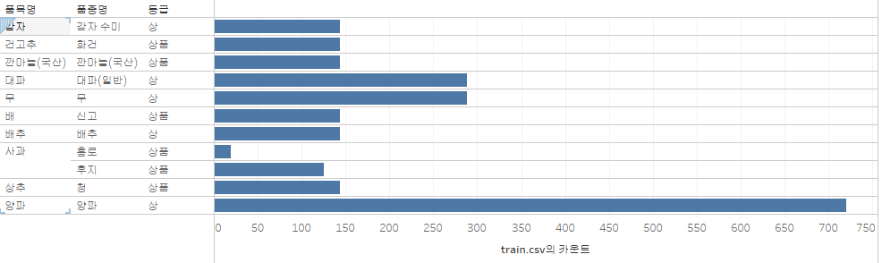
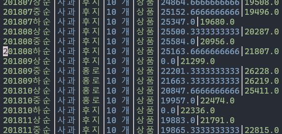

# EDA results

## 1. Objective

Input: 과거 3개월(상순, 중순, 하순)의 평균 가격 9개
Output: 미래 1개월(상순, 중순, 하순)의 평균 가격

TEST_00은 test 폴더의 TEST_00.csv 파일을 사용해 예측해야 한다.

## 2. Target Data

 
*Target data selected by Organizer*

### 2.1 데이터의 수

| **품목명** | **품종명** | **등급** | **데이터 수** |
| ---------- | ---------- | -------- | ------------- |
| 감자 | 감자 수미 | 상 | 144 |
| 건고추 | 화건 | 상품 | 144 |
| 깐마늘(국산) | 깐마늘(국산) | 상품 | 144 |
| 대파 | 대파(일반) | 상 | 288 |
| 무 | 무 | 상 | 288 |
| 배 | 신고 | 상품 | 144 |
| 배추 | 배추 | 상 | 144 |
| 사과 | 홍로 | 상품 | 19 |
| 사과 | 후지 | 상품 | 125 |
| 상추 | 청 | 상품 | 144 |
| 양파 | 양파 | 상 | 720 |

**데이터는 사과(홍로)가 극단적으로 적다.**

### 2.2 결측값은 0.0

 
*사과 홍로, 후지는 타켓 데이터인데 train.csv에 결측값이 있다.*

데이터를 살펴보면 0.0이 엄청나게 많은 것을 볼 수 있다.
아마도 결측값으로 추정.

**결측값을 제외한 데이터 수** 
| **품목명** | **품종명** | **등급** | **데이터 수** |
| ---------- | ---------- | -------- | ------------- |
| 감자 | 감자 수미 | 상 | 144 |
| 건고추 | 화건 | 상품 | 144 |
| 깐마늘(국산) | 깐마늘(국산) | 상품 | 144 |
| 대파 | 대파(일반) | 상 |  144  |
| 무 | 무 | 상 |  157  |
| 배 | 신고 | 상품 | 144 |
| 배추 | 배추 | 상 | 144 |
| 사과 | 홍로 | 상품 | 19 |
| 사과 | 후지 | 상품 | 125 |
| 상추 | 청 | 상품 | 144 |
| 양파 | 양파 | 상 |  630  |

1. 대파의 경우 거래단위가 "1키로단"인 경우 가격이 모두 제시되어 있지만, "10키로묶음"의 경우 가격이 0.0임
2. 무의 경우 거래단위가 "18키로상자(비닐포)"인 경우 2018년 5월 중순부터 데이터가 없다. 총 131개의 데이터가 제외됐다.
3. 양파의 경우 거래단귀가 "10키로"인 경우 87개가 0.0을 가진다. 그리고 "20키로"의 경우 2021년 4월의 데이터 3개가 결측됐다.

### 2.3 타겟이 아닌 값도 인풋에 넣는것을 고려해야 함

테스트 인풋에서 타겟이 아닌 데이터도 사용 가능
